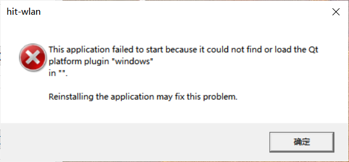
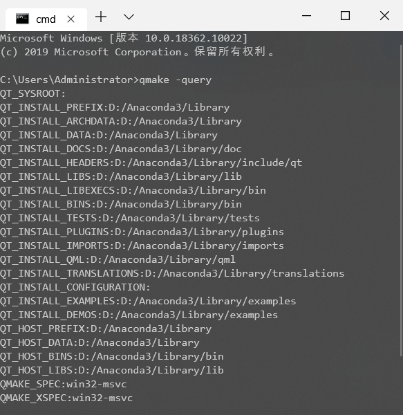
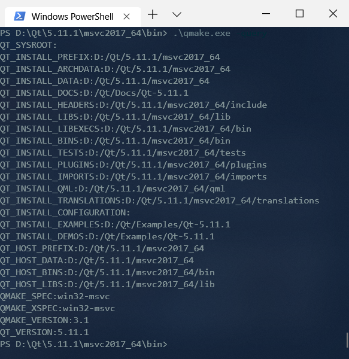
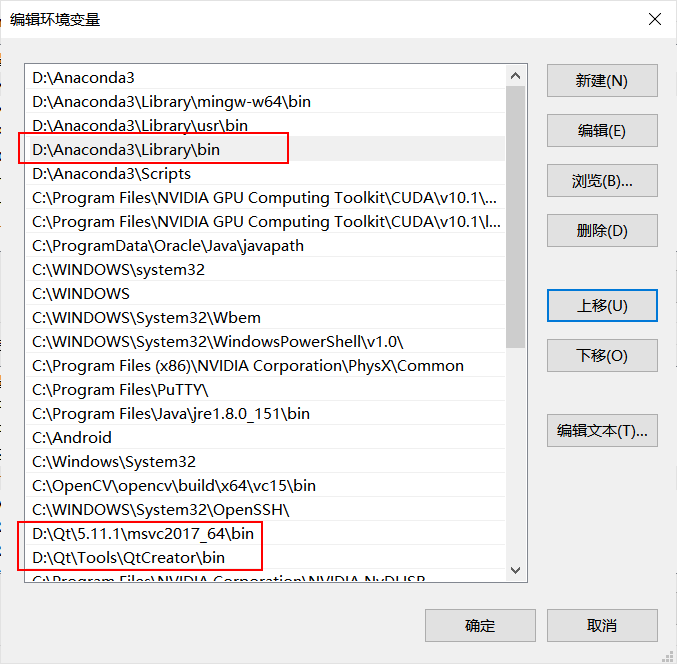
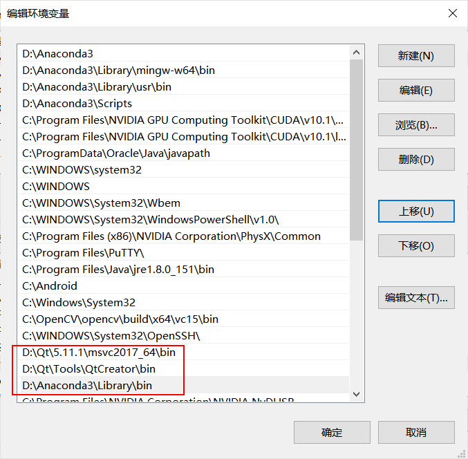
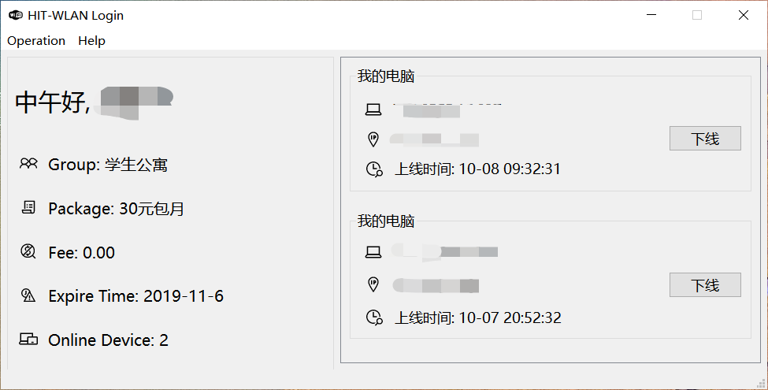

# 多个qmake共存可能造成的后果以及解决

前几天zzs脑子抽了把python3.7 3.6都卸了, 装了个什么Anaconda...这一装不要紧, 我电脑上自己写的Qt小程序全不好使了, 什么换壁纸啊什么校园网自动登录啊, 全都上天:( 于是实验也不写了, 一上午就怼这破事, 总算整明白了. 因为情况诡异, 百度上也不好找, 写一篇博客记录 ~~(凑数)~~

## 问题描述



大致问题就这样, 把错误信息放到网上一搜, 也是一大堆解决办法. 网上的解决方案, 无非是两种:

* 用`windeployqt`发布程序, 或者类似的复制一大堆库啊什么的到程序旁边
* 设置环境变量`QT_QPA_PLATFORM_PLUGIN_PATH`为你对应的`plugin/platform`, 然后就行了

这里边第一种不符合我的要求, 毕竟我不是要发布程序, 我只是自己用; 第二种实测对我不好使(其实对一般人应该是好使的, 但我的问题跟别人不太一样).

那我到底是什么问题呢? 我之前是正常的, 直到我安装Anaconda后出了问题. Anaconda做了什么? Anaconda给我安了一套Qt库. 所以, 我现在电脑上有 __两个qmake__! 一个是我一直在用的msvc2017_64, 一个是Anaconda带的qmake.

## 分析

为什么会有这种怪事? 为什么之前没有? 让我们看看. 

~~~ bash
qmake -query
~~~



再进入msvc的qmake所在目录, 运行同样的命令



可以看到, 直接调用的`qmake -query`全都指向了Anaconda下. 这和我们的期望不符, 我们希望它能指向后一个, msvc目录下的各个目录.

`qmake -query`命令的输出可以由qmake所在目录下的`qt.conf`覆盖. 也就是说, qmake旁边的`qt.conf`指定了这些路径. 让我们看看那里面都写了什么.

D:\Anaconda\qt.conf

``` conf
[Paths]
Prefix = D:/Anaconda3/Library
Binaries = D:/Anaconda3/Library/bin
Libraries = D:/Anaconda3/Library/lib
Headers = D:/Anaconda3/Library/include/qt
TargetSpec = win32-msvc
HostSpec = win32-msvc
```

再看看D:\Qt\5.11.1\msvc2017_64\bin\qt.conf

``` conf
[Paths]
Documentation=../../Docs/Qt-5.11.1
Examples=../../Examples/Qt-5.11.1
Prefix=..
```

`Prefix`指示根目录, 那么Anaconda下的qt.conf指向`D:/Anaconda3/Library`, msvc下的qt.conf指向`D:\Qt\5.11.1\msvc2017_64`.

所以我们大致可以明白, 我们的`qmake -query`调用的是Anaconda目录下的qmake.exe, 而我们想要调用msvc目录下的qmake.

于是问题就变成, 同样是qmake, 为什么我们在控制台里敲的qmake调用的是Anaconda的qmake而不是我们原来的, 配置了正确环境变量的msvc下的qmake呢?

想想, 在cmd里敲一个`qmake`, 为什么能执行呢? 因为我们在系统环境变量里, 在`PATH`里添加了它的路径. 当你执行一条命令, cmd先在当前目录下查找该可执行文件`qmake`, 如果没找到则在`PATH`记录的路径里查找这个文件.
很显然, `PATH`里的目录们是按顺序查找的. 也就是说, 如果我有若干个目录下都有`qmake.exe`, 那么调用的就是最靠前的一个目录下的`qmake.exe`.

让我们看看我此时环境变量的设置:


`D:\Anaconda\Library\bin`和`D:\Qt\5.11.1\msvc2017_64`下都存在`qmake.exe`, 于是调用的是前一个目录, 也就是Anaconda的qmake.

于是我们的想法也简单, 把`D:\Anaconda\Library\bin`下移到`D:\Qt\5.11.1\msvc2017_64`下面.



大功告成



Nice!

## 结尾

虽然百度的教程还有Qt论坛什么的到最后并没有什么用...但还是感谢写教程的各位dalao...
嗯, 最后, 因为我Anaconda用的还不是很多, 这种办法对Anaconda有什么影响也还不清楚(我想我应该用不上pyqt罢...)如果有问题或许换回来就好了罢hhhh

蟹蟹你能来看, 如果觉得有用可以收藏我的博客哦)/
